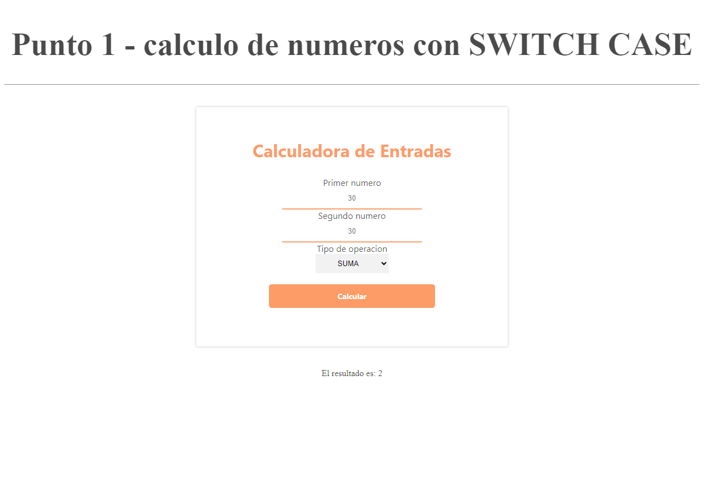
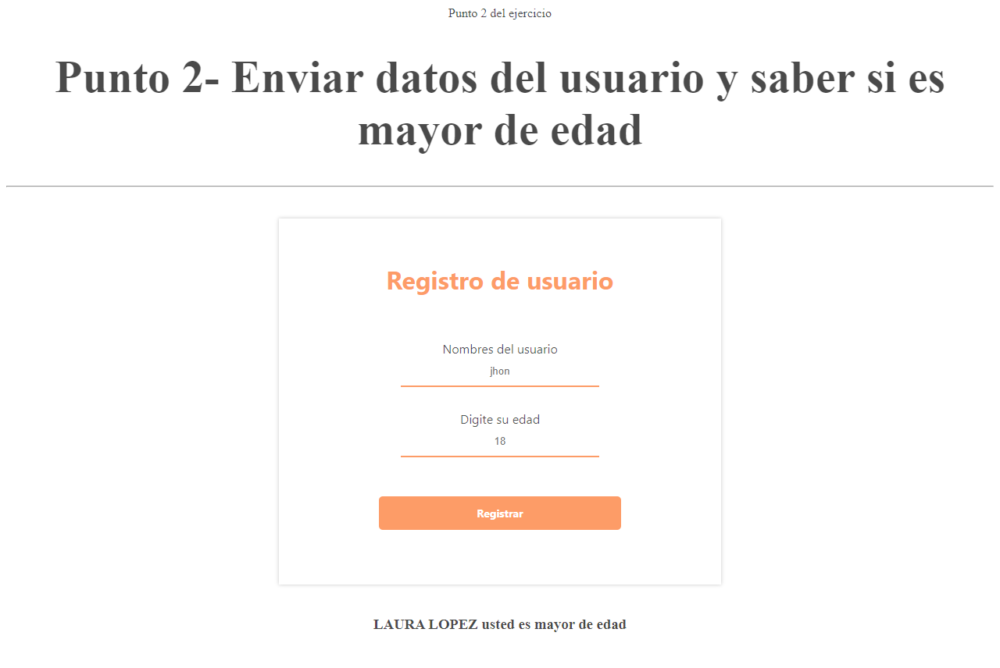
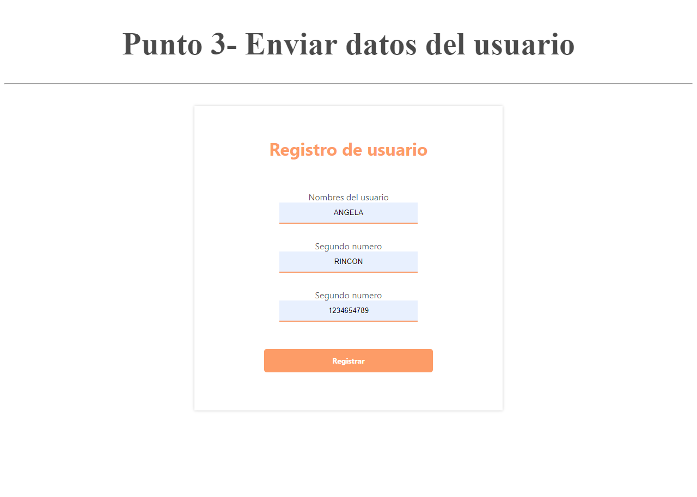
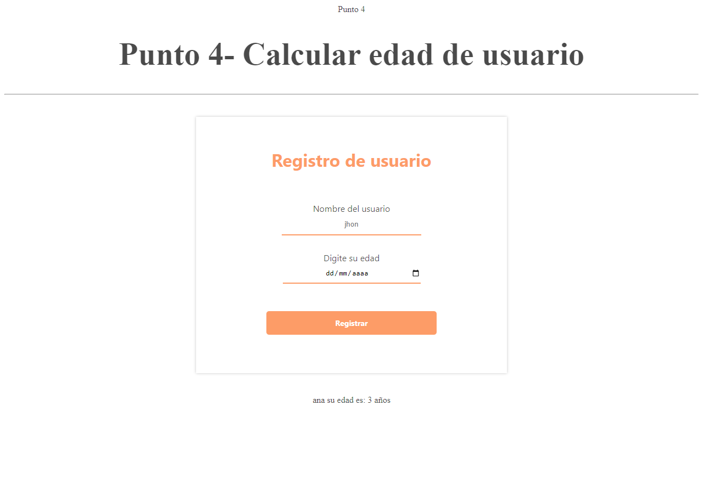
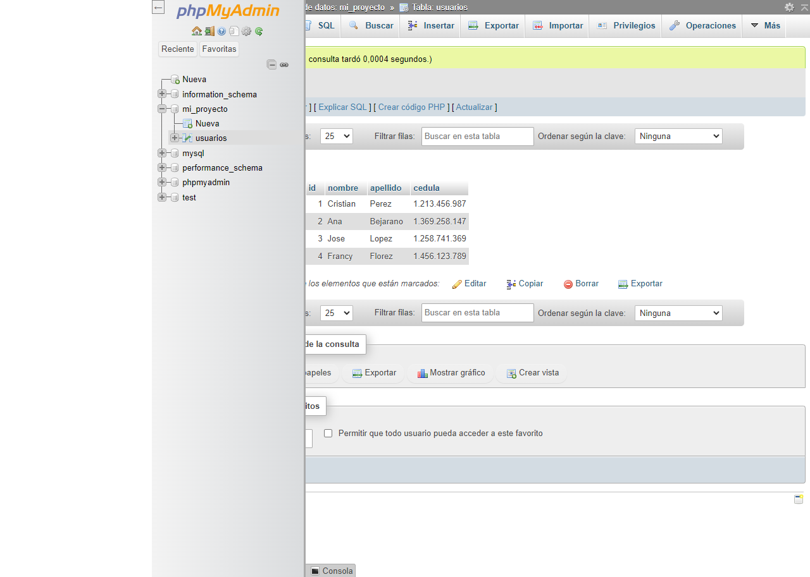
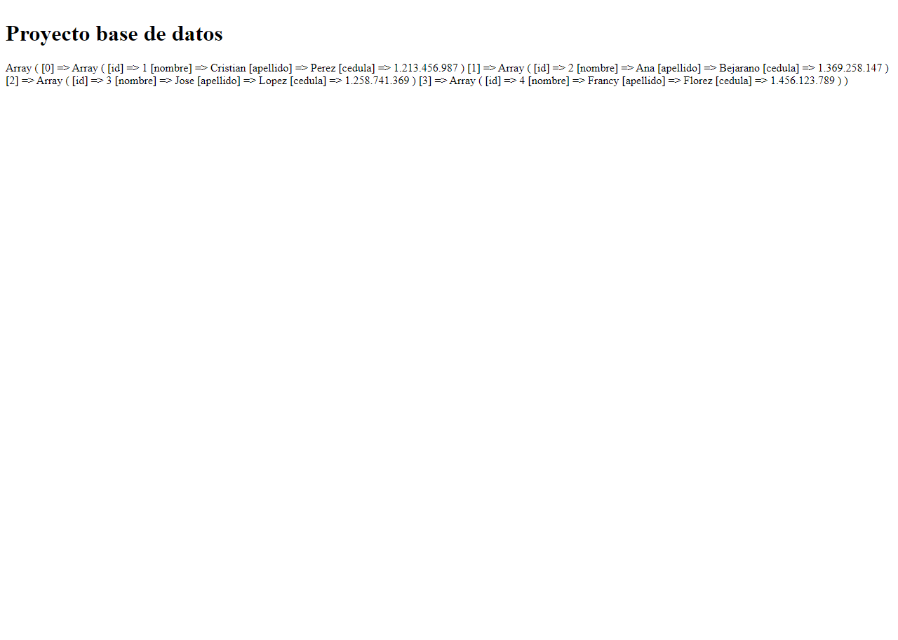
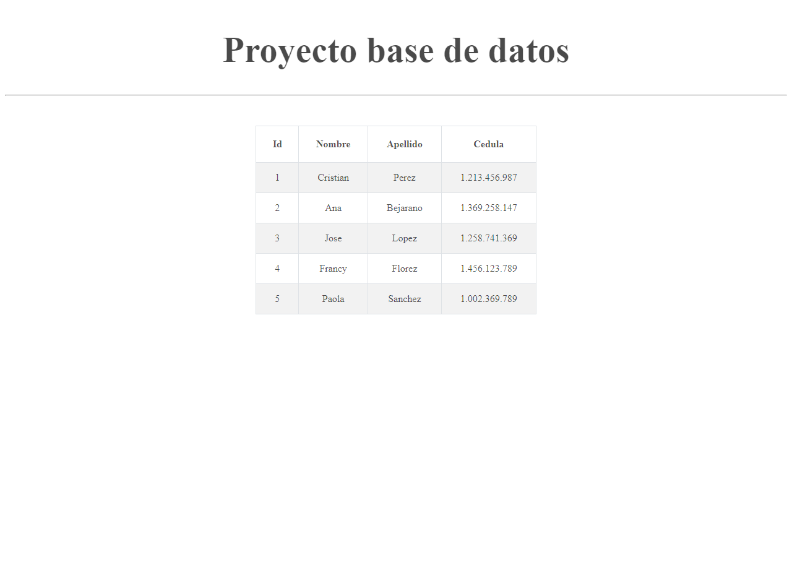

<h1>TALLER 10: ANGELICA RINCON</h1>
<h1>link pagina web</h1>
<a href="https://angela-2017.github.io/taller-10-fullstack/" target="blank">Link pagina web</a>

<h1>link GITHUB</h1>
<a href="https://github.com/Angela-2017/taller-10-fullstack " target="blank">Link GITHUB</a>

<h2>Informacion</h2>

Curso Full Stack basico-Grupo 1

Angelica Rincon

<h2>Punto 1: </h2> 
<h3>Calcualdora de operaciones</h3>

<h2>Punto 2: </h2>
<h3>Envio de datos de usuario y saber si es mayor de edad</h3>

<h2>Punto 3: </h2>
<h3>Envio de datos de usuario a otra pagina</h3>

<h2>Punto 4: </h2>
<h3>Calculo de edad</h3>

<h2>Punto 5-6-7: </h2>
<h3>5-BASE DE DATOS</h3>

<h3>6-CONEXION BASE DE DATOS A PHP</h3>

<h3>7- Muestra de datos en pantalla</h3>
