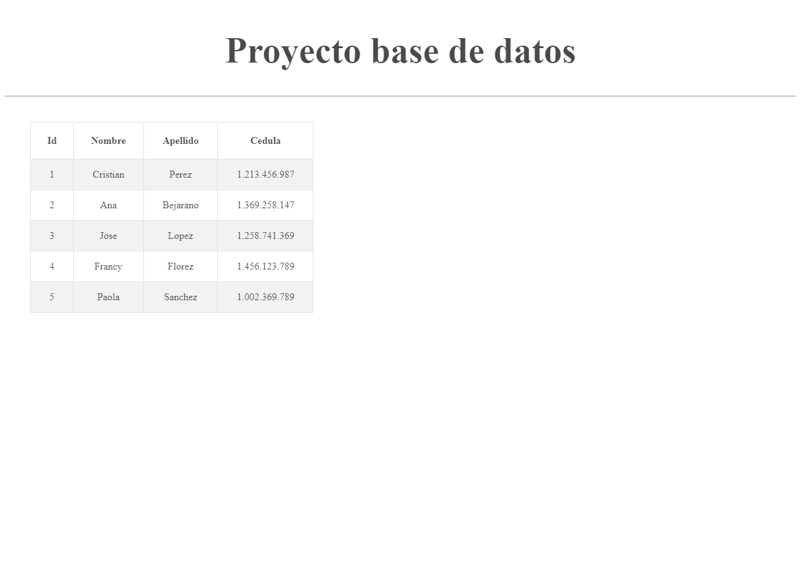

<h1>TALLER 10: ANGELICA RINCON</h1>

<h2>Informacion</h2>

Curso Full Stack basico-Grupo 1

Angelica Rincon

<h2>Punto 1: </h2> poner los pantallazos de como quedo el ejercicio aqui en cada punto
<h3>Calcualdora de operaciones</h3>

<h2>Punto 2: </h2>

<h2>Punto 3: </h2>

<h2>Punto 4: </h2>

<h2>Punto 5-6-7: </h2>
<h3>5-BASE DE DATOS</h3>

<h3>6-CONEXION BASE DE DATOS A PHP</h3>

<h3>7- Muestra de datos en pantalla</h3>
